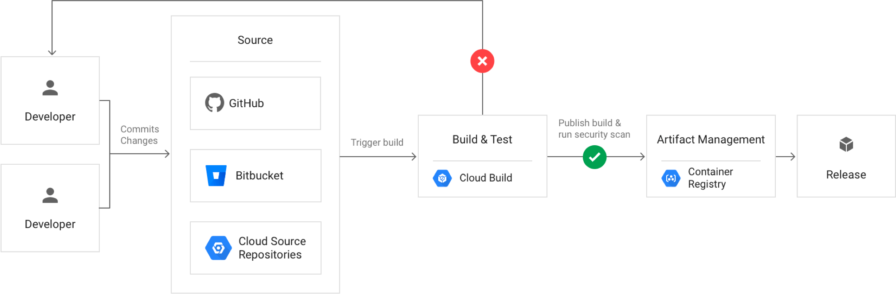

# Integración Continua y Despliegue continuo

## Desarrollo tradicional

### Ventajas
  * Se aumenta la funcionalidad muy rápidamente (Ya que añadimos un gran número de funcionalidades al codigo de golpe)
  * Solamente una persona se preocupa de las releases a producción, dejando a los desarrolladores que se centren exclusivamente en sus tareas.
### Desventajas
  * Se hace dificil probar tanta funcionalidad nueva en poco tiempo, justo antes de la release
  * Los programadores pierden la noción de la evolución del proyecto a nivel global.
  * Los merges pueden llegar a ser muy complejos.
  * A menudo fallan desarrollos y apenas hay tiempo para arreglarlo

## Integración continua

Consiste en agregar todo el código que generan los desarrolladores de un proyecto cuanto antes y lo más a menudo posible. Esto forma de actuar tiene ciertas implicaciones:

* Desarrollo de sistemas de test automáticos. (unitarios e integración)
* Compilación y generación de artefactos de forma atuomática
* Test de seguridad automaticos
* Pull Requests o Merge Requests

### Flujo
Aqui podemos observar un ejemplo de flujo para una integracion continua

### Ventajas

* Mejora la eficiencia y productividad durante el desarrollo: Después de cada cambio se puede observar como ha afectado el cambio al programa o sistema global
* Entregas con menor riesgo y de mayor calidad: Cada entrega tiene una funcionalidad más controlada, ya que ha pasado por todos los automatismos de test, de seguridad y de despliegue
* Menos costes: Los procesos de automatización, junto con el menor riesgo y la mayor calidad de las entregas hacen que los desarrolladores se centren en lo que tienen que hacer, desarrollar nueva funcionalidad, que es lo que da valor a un producto de cara a un cliente
* Agile: La integración continua encaja muy bien con formas de trabajar de tipo Agile, de hecho es un pilar necesario para llevar a cabo un proyecto con estas metodologías.

## Despliegue Continuo

* **Zero downtime** No queremos bugs o incompatibilidades en la API por lo que los despliegues continuos van acompañados de sistemas de monitorización, y de alerting para que en caso de fallo, porder hacer un rollback a la versión anterior.

* **Rolling Update** Mientras nuestro servicio está en producción, añadimos nuevas instancias del servicio progresivamente, de forma que un porcentaje de la carga lo van recibiendo las nuevas instancias.

* **Blue Green Deployment** Mientras nuestro servicio está en producción, levantamos el mismo número de instancias del servicio actualizado, una vez que nos hayamos asegurado de que las instancias actualizadas están en funcionamiento, cambiamos la configuración del balanceador (DNS, CDN, o cualquier otra pieza) para que toda la carga llegue a las nuevas instancias con el servicio actualizado.

## Tipos de tests

  * **Test unitarios**: Este tipo de testing consiste en probar de forma individual las funciones y/o métodos
  * **Test de integracion**: Las pruebas de integración verifican que los diferentes módulos y/o servicios usados por nuestra aplicación funcionen en armonía cuando trabajan en conjunto.
  * **Test de seguridad** El objetivo principal es Prueba de seguridad es identificar las amenazas en el sistema y medir las vulnerabilidades potenciales
  * **Test de rendimiento** Las pruebas de rendimiento verifican cómo responde el sistema cuando éste se encuentra bajo una alta carga.